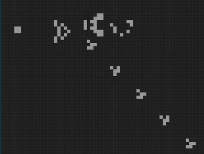

### Conway's game of life :heart_eyes:
This is a simple implementation of `Convway's game of life`.

You can run it simply using `main.py`.
> **The Game of Life**, also known simply as **Life**, is a cellular automaton devised by the British mathematician **John Horton Conway** in 1970. It is a zero-player game, meaning that its evolution is determined by its initial state, requiring no further input. One interacts with the Game of Life by creating an initial configuration and observing how it evolves. It is Turing complete and can simulate a universal constructor or any other **Turing machine**.

#### **Controls :video_game: :**
- Press `LeftMouseButton` on a square to toggle it's state (`alive` <-> `dead`)
- Drag the mouse to draw (`LeftMouseButton` -> `alive`, otherwise -> `dead`)
- Press `s` to toggle the simulation
- Press `g` to toggle grid visualization
- Press `r` to kill all cells (reset the configuration). Works only when the simulation is paused

{: width="400" height="300"}

Go nuts :chestnut:
